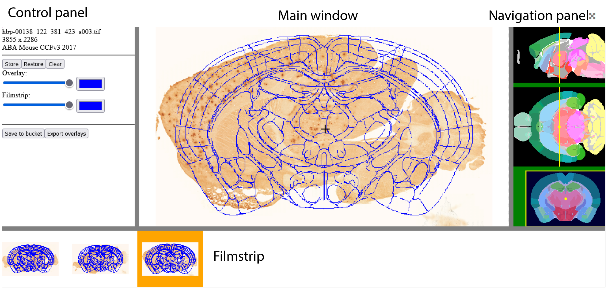

**Introduction**
------------------- 
WebAlign is an online tool for spatial registration of histological section images from rodent brains to reference 3D atlases.
Different experimental datasets registered to the same reference atlas allows you to spatially integrate, analyse and navigate these datasets within a standardised coordinate system.
The linear registration obtained with WebAlign can be refined with the WebWarp tool (https://webwarp.readthedocs.io/en/latest/).

WebAlign and WebWarp are part of the online QUINT workflow. 
Find manual for the online QUINT workflow here: https://quint-webtools.readthedocs.io/en/latest/

To access it, go to the `Online Workbench <https://neural-systems-at-uio.github.io/>`_, register for an EBRAINS account and login.

Dataset DOI: 10.25493/G6CQ-D4D
