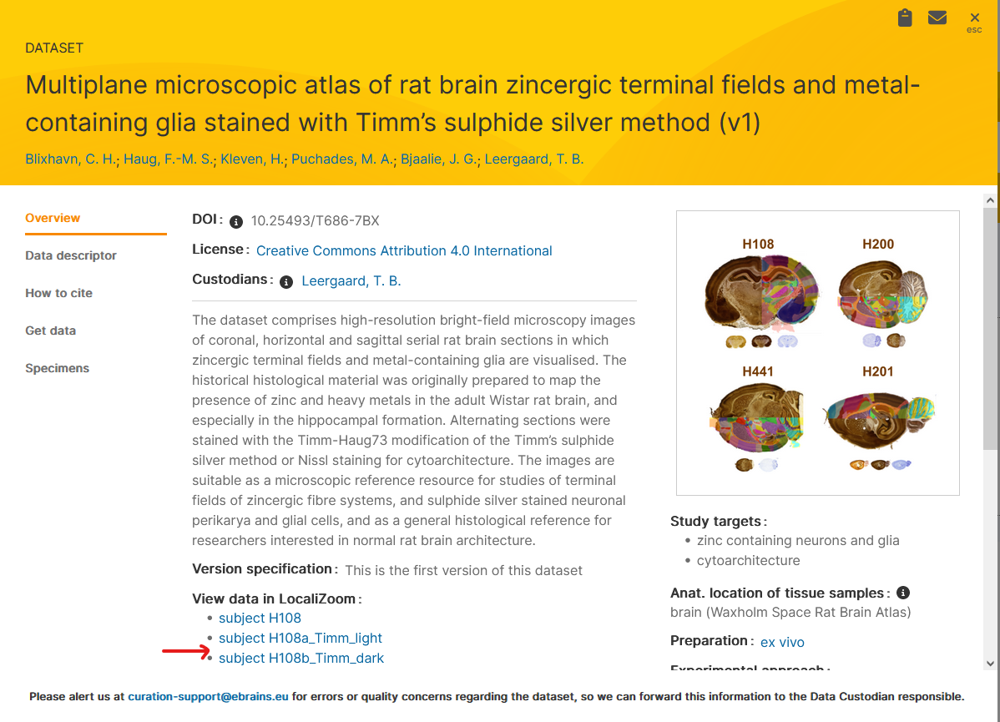

**Opening a sample dataset**
-------------------------------

.. tip::  When working in the workbench, please see intructions here: https://quint-webtools.readthedocs.io/en/latest/WebAlign.html

The following description concerns the use of WebAlign in the collaboratory.

A Demo dataset is present in a Demo collab: https://wiki.ebrains.eu/bin/view/Collabs/image-registration-and-analysis-demo

Load the file by clicking on the file: "demo_mouse_data_start.waln"

Instructions about the operations are found both under "Documentation" on the upper right and inside the application by pressing the question mark.
In this ReadtheDocs, go to the next page for illustrated alignment instructions.

You can see the result of a finished anchoring by choosing the file: "demo_mouse_data.waln"

**Work with your own images**
----------------------------------------------------
**1. Prepare your images before upload by naming them according this naming convention:**

The ID should be unique to the particular brain section and in the format sXXX, with XXX representing the section number. The section number should reflect the serial order and spacing of the sections (e.g., s002, s006, s010 for every 4th section starting with section 2).

Example: tg2345_MMSH_s001_segmentation.png or tg2345_MMSH_s001.tif

- Upload the images you want to work with into the bucket of your collab using the Data proxy (press on "Bucket")

**2. Start the creation of your brain series using the "QUINT Image creator" webapp**

Click on your images in order to select them and press the "create brain from selection" button. Choose a name for your serie.

The App will automatically generate the files for you. Monitor the progress under the "processing" tab and on the two dashboards on the left.

When the ingestion is finished, your serie will appear under the "Prepared Brains" tab.

Click on the "View Brain" button in order to preview your images.

Now go to the WebAlign app in order to start the registration to atlas.

**Opening of your own dataset in WebAlign**
------------------------------------------

1. Start a new registration by pressing "create new series", the UI will ask you for the name of your series. E.g. my-registration

2. The name of the present bucket is prefilled but you if your ingested data are located in another collab, you can type the name of that collab

3. Choose the target atlas (WHSv4 for Rat and CCFv3_2017 for Mouse).

4. WebAlign will search for DZIP files and list those found.

5. Press "create". The main window will now display WebAlign. This step can take some time.
Your file is saved in the Bucket as a .waln file

.. image:: images/image2.png
  :width: 3.30139in
  :height: 3.54662in

**Work with EBRAINS datasets**
---------------------------------
If you would like to work with an EBRAINS dataset, open the LocaliZoom link from the KG dataset card ( https://search.kg.ebrains.eu) and paste it in the "Import LocaliZoom link" tab.

These series already have been registered to a reference atlas, so this gives you a starting point. The linear registrations obtained with WebAlign can be refined using WebWarp.
  

Dataset DOI: 10.25493/T686-7BX

.. image:: images/Fetch_LZ_dataset.png
  :width: 3.30139in
  :height: 3.54662in
