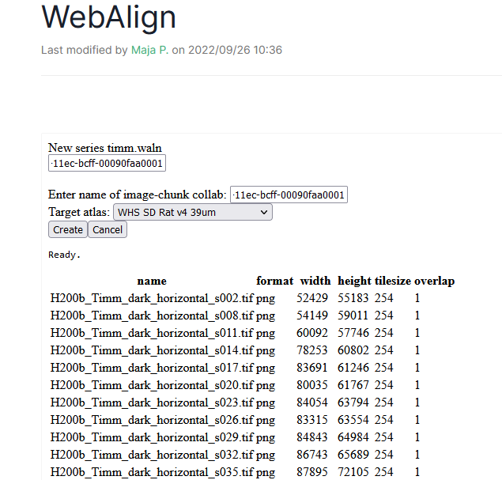

**My online Workspace**
-------------------------------
You will have your personal workspace either you choose the QUINT online or the LocaliView workflow

See instructions on the workflows readtheDocs. You will be able to uplaod your section images to your workspace and start the registration to a reference 3D atlas.

**Work with EBRAINS datasets**
---------------------------------
If you would like to work with an EBRAINS dataset that has already been registered to atlas, open the LocaliZoom link from the KG dataset card ( https://search.kg.ebrains.eu) and paste it in the "Import LocaliZoom link" tab.

These series already have been registered to a reference atlas, so this gives you a starting point. The linear registrations obtained with WebAlign can be refined using WebWarp.
  

Dataset DOI: 10.25493/T686-7BX

